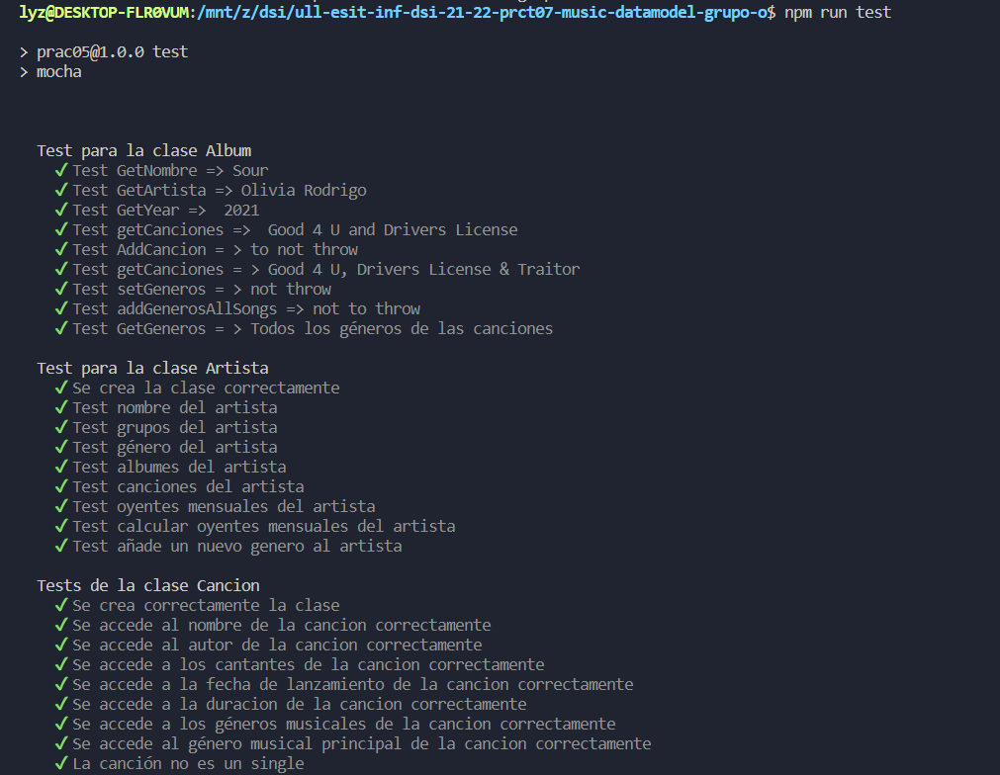
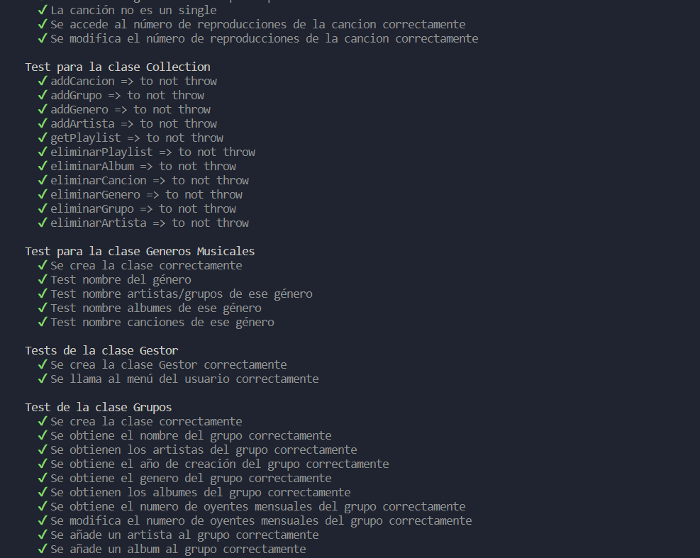
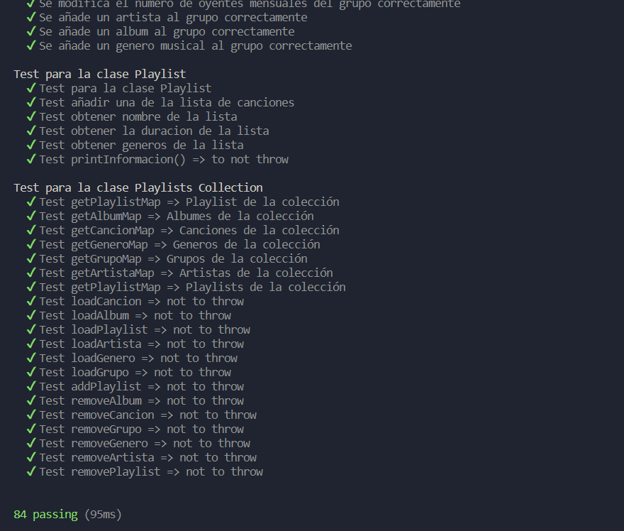
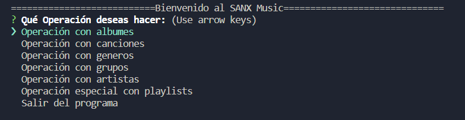
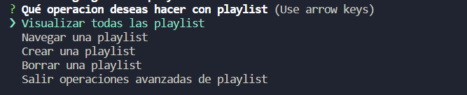
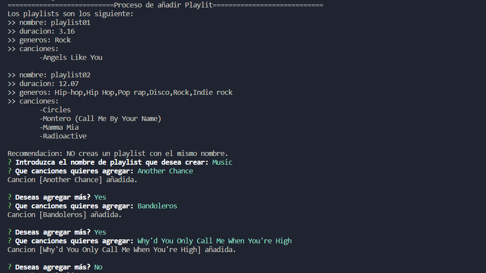
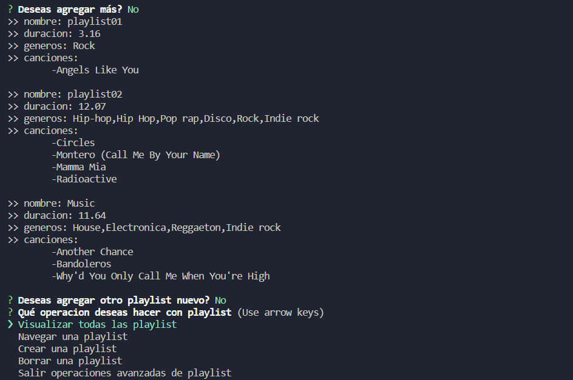
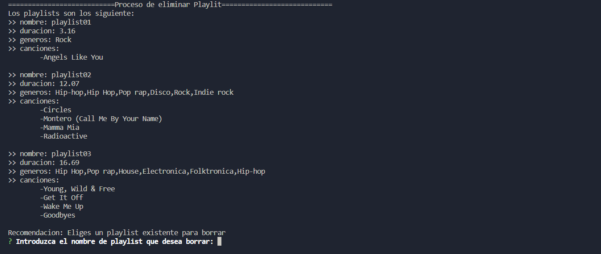
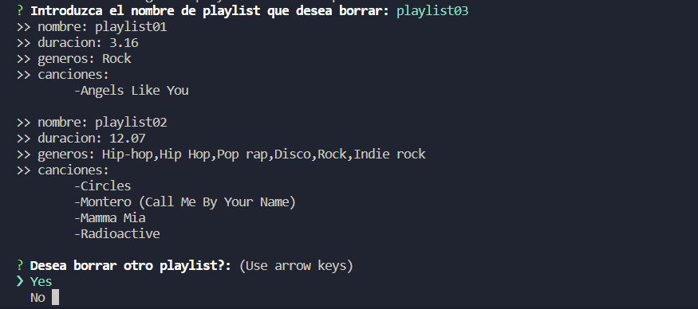

# 07 - Digitalizando la colección de música de los abuelos
```
Curso: 2021- 2022
Universidad: Universidad de La laguna
Asignatura: Desarrollo de Sistemas Informaticos
Herramienta: Visual Studio Code
Lenguaje de programción: TypeScipt
```

```
>>  PROYECTO: Un sistema de bibliteca musical
>>  EQUIPO: Grupo_O
>>  CURSO: 2021 - 2022
>>  COMPONENTES: XueMei Lin
>>               Noelia Ibáñez Silvestre
>>               Andrea Hernandez Martín
>>               Stephanie Andreína Arismendi Escobar
>>  EMAIL:       alu0101225845@ull.edu.es
>>               alu0101225555@ull.edu.es
>>               alu0101119137@ull.edu.es
>>               alu0101351728@ull.edu.es
>>  UNIVERSIDAD: Universidad de La Laguna
>>  ASIGNATURA:  Desarrollo de Sistemas informáticos
>>  VERSION:     1.0.0
>> Herramienta: Visual Studio Code
>> Lenguaje de programción: TypeScript
```

## 1. Introducción
Esta práctica consiste en llevar a cabo un diseño del modelo de datos de un sistema de información que permita almacenar una biblioteca musical. Además, dicho diseño se tendrá que implementar con el lenguaje de programación TypeScript.    

## 2. Objetivos
El objetivo de esta práctica es aprender a diseñar e implementar un modelo de datos siguiendo el diseño orientado a objetos. También, se debe aprender a utilizar las herramientas descritas en clase, las cuales son la documentación mediante TypeDoc, las pruebas unitarias del código fuente con Mocha y Chai, siguiendo la métodología TDD o BDD, el uso de Instanbull y Coveralls para el cubrimiento de código, con la integración continua con Github Actions y la comprobación de la calidad del código mediante Sonar Cloud. Además, se debe aprender el uso de Inquier y Lowdb para gestionar una base de datos por la consola.

## 3. Biblioteca Musical
La biblioteca musical almacena la información necesaria para poder representar playlists y canciones, además de reprensentar el género musical, los artitas, los grupos y albumes de ambas. También se encarga de manejar las playlists para que el usuario de la biblioteca pueda ver todos los datos almacenados dentro de ella, así como modificar, añadir y eliminar canciones y playlists.  En primer lugar, para realizar la representación de los datos, se creó una clase para cada tipo de datos a almacenar, luego, se crearon cuatro clases más para poder manejar los datos, almacenarlos en una base de datos y poner en funcionamiento la aplicaciónestas.  

### 3.1. Clase Genero Musical
Esta clase es la encargada de representar un género musical, los atributos que permiten la representación de dicha clase son el nombre del género musical, un array con todos los grupos o artitas que producen música de ese género, un array con los álbumes que hay relacionados con ese género y un array con todas las canciones que tienen ese género musical.  Los métodos implementados en esta clase son todos métodos que permiten acceder a cada atributo `(getters)` debido a que todos los atributos son privados en la clase.

### 3.2. Clase Cancion
Esta clase es la encargada de representar una canción, los atributos que permiten la representación de dicha clase son el nombre de la canción, el autor, la duración, los géneros musicales que tiene dicha canción, un atributo que dice si la canción es un single o no, el número de reproducciones totales y la fecha de lanzamiento de la canción. Los métodos implementados en esta clase son los métodos que permiten acceder a cada atributo `(getters)` debido a que todos los atributos son privados en la clase y también se implementó un único método que modifica el número de reproducciones `(setter)` ya que es el único atributo que puede cambiar. 

### 3.3. Clase Álbum
Esta clase es la encargada de representar un álbum, los atributos que permiten la representación de dicha clase son el nombre del álbum, el nombre del grupo o artista que lo publicó, el año de publicación, un array con los géneros musicales que lo componen y un array con todas las canciones que perteneces al album. Los métodos implementados en esta clase son los métodos que permiten acceder a cada atributo `(getters)` debido a que todos los atributos son privados en la clase. También se implementó un método que añade canciones nuevas, otro método que añade los géneros de una canción y por último, otro método que añade todos los géneros de todas las canciones al album.  

### 3.4. Clase Grupos
Esta clase es la encargada de representar un grupo musical, los atributos que permiten la representación de dicha clase son el nombre del grupo, un array con todos los artistas que forman el grupo, el año de creación, un array con los géneros musicales que produce el grupo, un array con todos los álbumes en los que ha participado, otro array con todas las canciones publicadas por ese grupo y la cantidad de oyentes mensuales. Los métodos implementados en esta clase son los métodos que permiten acceder a cada atributo `(getters)` debido a que todos los atributos son privados en la clase. Además de implementar un método que permite modificar el atributo de oyentes mensuales `(setter)` ya que es un atributo que se debe cambiar mensualmente. También se implementó un método que permite añadir artistas nuevos, otro que permite añadir álbumes y por último, otro método que permite añadir un género musical al grupo.  

### 3.5. Clase Artista
Esta clase es la encargada de representar un artista, los atributos que permiten la representación de dicha clase son el nombre del artista, el nombre del grupo al que pertenece, un array con todos los géneros musicales que compone, otro array con todos los álbumnes en los que aparece, un array con todas las canciones que ha publicado y la cantidad de oyentes mensuales. Los métodos implementados en esta clase son los métodos que permiten acceder a cada uno de los atributos de la clase `(getters)` debido a que todos ellos son privados en la clase. También se implementó un método que calcula los oyentes mensuales del artista de forma que suma los oyentes de los grupos a los que pertenece el artista más el número de reproducciones de las canciones del mismo artista y se divide entre 12, obteniendo así el número de oyentes mensuales.  

### 3.6. Clase Playlist
Esta clase es la encargada de representar una playlist, los atributos que permiten la representación de dicha clase son el nombre de la playlist, un array con todas las canciones incluidas dentro de esa playlist, la duración total de la playlist y los géneros musicales que tiene la playlist. Los métodos implementados en esta clase son los métodos que permiten acceder a cada uno de los atributos `(getters)` debido a que todos los atributos son privados en la clase. Y también se implementó un método que añade canciones nuevas a la playlist.

### 3.7. Clase Gestor
Esta clase es la encargada de gestionar, como su nombre indica, las peticiones del programa. Se construye pasando como parámetro un array de `Playlist` que contiene todas las playlist de la aplicación. Seguidamente lo mapeará y almacenará sus características principales: `Canciones`, `Duracion` y `Generos`.
También cuenta con un método de impresión, que muestra los datos de todas las playlist, y es usado en el método visualizar (prácticamente lo mismo, pero añadiendo que el menú aparezca una vez se impriman). Otras opciones implementadas son las de navegar una playlist y mostrar la información de la misma, así como crear, ordenarlas y eliminarlas. Todo ello se realiza desde `menuUser`, con un switch de comandos que hace uso de `Inquirer`. Otra de las opciones disponibles, es implementadas en el método `ordenPlaylist()`, el cual ordena las canciones de una playlist elegida por el usuario según dos parámetros, el primero es según el tipo de orden (nombre, artitas, duracion, fecha, ...) y el segundo parámetro según la forma (ascendente o descendente).  

### 3.8. Clase jsonPlaylist
Esta clase es la encargada de gestionar la lectura y escritura en la base de datos json del programa, extentiendo de la `Clase Gestora`. Al constructor se le pasa un nombre de usuario y todas las playlist de la aplicación. Si la base de datos ya tiene la playlist, entonces  se mapea; en caso contrario se escribe. Los métodos implementados que se encontrarán en dicha clase son los necesarios para guardar las `Playlists` y eliminar los `Albumes`, `Canciones`, `Grupos`, `Generos`, `Artistas` y también las mismas `Playlists`. Además, el método `getAllPlaylist()`, es el encargado de retornar el contenido de todas las playlists almacenadas en la base de datos. 


### 3.9. Clase Collecction
Esta clase en la encargada de gestionar las colecciones creadas por cada clase (Album, Cancion, Grupos, GenerosMusicales, Artistas, Playlist), como podemos observar en el constructor de la propia clase usando la clase `Map` para guardar cada coleccion:

```
constructor() {
    this.itemMapAlbum = new Map<string, Album>();
    this.itemMapCancion = new Map<string, Cancion>();
    this.itemMapGrupo = new Map<string, Grupos>();
    this.itemMapGenero = new Map<string, GenerosMusicales>();
    this.itemMapArtista = new Map<string, Artistas>();
    this.itemMapPlaylist = new Map<string, Playlist>();
}
```
Además, se definen e implementan todos los métodos usados por dichas clases. Como por ejemplo, los métodos pertenecientes a la clase `Playlist` que se muestran a continuación:

```
  /**
   * Método que añade una playlist a la colección
   * @param nombrePlaylist Nombre de la playlist
   * @param nombreCancion Nombre de todas las canciones de la playlist
   */
  addPlaylist(nombrePlaylist: string, nombreCancion:string[]) {
    const canciones:Cancion[] = [];

    nombreCancion.forEach((cancion) => {
      canciones.push(this.itemMapCancion.get(cancion) as Cancion);
    });

    const nuevoPlaylist = new Playlist(nombrePlaylist, canciones);
    this.itemMapPlaylist.set(nuevoPlaylist.getNombre(), nuevoPlaylist);
  }

  getPlaylist(playlistName:string): Playlist | undefined {
    return this.itemMapPlaylist.get(playlistName);
  }

  /**
   * Método que elimina una playlist de la colección
   * @param nombrePlaylist Nombre de la playlist a eliminar
   */
  eliminarPlaylist(nombrePlaylist: string) {
    this.itemMapPlaylist.delete(nombrePlaylist);
  }

  /**
   * Método que devuelve todas las playlists
   */
  getAllPlaylist(): Playlist[] {
    return [...this.itemMapPlaylist.values()];
  }
```


### 3.10. Clase App  
La clase App es la encargada de inicializar la aplicación, el funcionaimiento de la aplicacion consiste en la `class app`, donde en el constructor inicializa y accede a la base de datos existente `JsonDatabase.json`, en la que están los álbumnes, las canciones, los grupos, las artistas, los generos y todas los playlist.  
A continuación, en primer lugar tenemos la funcion `userMenu()` en la que se usará `inquirer` para interactuar con el usuario. En dicha función, inicialmente se pregunta al usuario `Qué operacion quiere hacer`:
> - **Operacion con albumnes**
> - **Operacion con canciones**
> - **Operacion con generos**
> - **Operacion con grupos**
> - **Operacion con artistas**
> - **Operaciones avanzadas con playlist** (Esta operación utilizará la clase gestora comentada anteriomente)  

Dependiendo de la opcion que elija el usuario, entramos el método `operacion(option:string)`, el cual pregunta al usuario que operación desea hacer: 
> - **Visualizar**
> - **Añadir**
> - **Borrar**
> - **Modificar**

En el método `Visualizar()`, se utiliza la funcion que proporciona **lowdb** `JSON.stringify()` con la cual se pueden mostrar todos los datos según el tipo de datos que desea el usuario.  

En el método `add()`, se usa **inquirer** para preguntar al usuario los datos que quiere agregar. Se comprueba que no existen en la `jsonDataBase.json` y que los datos introducidos son válidos. Se utiliza cada clase para crear el objeto que se quiere agregar y lo añadimos a la colección de datos.  

En el método `borrar()`, igual que el método anterior, se usa **inquirer** para preguntar al usuario el nombre del objeto que desea eliminar y usa la funcion, **por ejemplo en el caso de canciones**: `this.database.get('canciones').remove({nombre: cancionEliminar}).write();` , que elimina directamente el objeto que está dentro de `canciones` y según el nombre que introduce el usuario (en este caso el nombre es el dato único) elimina el objeto de cancion.

En el método `Modificar()`, usamos **inquirer** para preguntar en qué album, cancion, genero, artista o grupo se desea modificar los datos.
**Por ejemplo en el caso de album se haría de la siguiente forma**: 
`this.database.get('albumes').find({nombre: albumMoficar}).set(tipoDatoMoficar, dataMoficar).write();`, se utiliza `get()` para acceder a **albumes**, `find()` para encontrar el objeto con el nombre introducido, `set()` para modificar el dato que desea cambiar el usuario y `write()` para guardar el cambio.  

## Documentación TypeDoc  
Para la documentación de los ejercicios se utilizó la herramienta TypeDoc que convierte los comentarios en el código fuente de TypeScript en documentación HTML renderizada. A continuación, se adjunta el enlace a la página web creada mediante TypeDoc.  
[Enlace repositorio documentacion Typedoc](https://github.com/ULL-ESIT-INF-DSI-2122/ull-esit-inf-dsi-21-22-prct07-music-datamodel-grupo-o/tree/main/docs)  

## Testing  
Para la realización del testing de los ejercicios se utilizaron las herramientas Mocha y Chai.  
Se han realizado pruebas sobre todas las clases implementadas para el correcto funcionamiento de la aplicación, en las cuales se comprueba que los valores pasados por parámetro dan el resultado esperado o al contrario, es decir, se comprueba que no dan el resultado esperado. Para ello se ha creado un fichero `clase.spec.ts` para cada clase y se han añadido algunas pruebas de todas las funciones utilizadas.  

A continuación se muestra la salida en la terminal al ejecutar el test.  





## Resultado final
*Nota: el funcionamiento de los demás apartados son similares al mostrado en el ejemplo.*
A continuación se muestra un ejemplo del funciomamiento de añadir y borrar playlist:

**Menú principal**



**Menú 'Operación especial con playlists'** 



**Proceso de crear una playlist nueva**



**Proceso creación de una playlist finalizado**



**Proceso de borrado de una playlist**



**Proceso de borrado de una playlist finalizado**

*'Playlist03' eliminada*


##  4. Conclusiones
Con la realización de esta práctica se ha podido aprender a utilizar herramientas como `Inquirer`, bastante útil y estéticamente formal para programas de terminal; también se ha tenido que practicar la creación de una base de datos por medio de `Lowdb` y JSONs, algo de vital importancia para la permanencia de datos y una salida fácil y rápida para una aplicación sencilla.  

Además, al ser un trabajo de grandes dimensiones y mucho trabajo en grupo, se ha podido experimentar muy por encima lo que podría llegar a ser un proyecto de la vida real, con una división de trabajos, un tiempo límite y un producto de utilidad en el día a día (como vendría a ser una colección musical).  

En cuanto a las dificultades que hemos tenido realizando la práctica, lo que cabe destacar ha sido el uso de `lowdb` ya que es una herramienta que no habíamos utilizado con anterioridad y al principio nos pareció complicada de entender, pero al final con el desarollo de la práctica pudimos comprender su uso.  

Por otra parte, en cuanto al trabajo realizado, fue un trabajo en grupo en el que la mayor parte de las veces nos conectamos todos los miembros del grupo mediante Live Share, de manera que hicimos el trabajo totalmente colaborativo. Solo hubieron ciertas tareas que nos repartimos para hacer cada una por separado.  

## 5. Bibliografía
- [Clases abstractas e interfaces](https://ifgeekthen.everis.com/es/clases-abstractas-e-interfaces)
- [Relaciones de clases abstractas](https://qastack.mx/programming/597769/how-do-i-create-an-abstract-base-class-in-javascript)
- [Clases y métodos](https://lenguajejs.com/javascript/caracteristicas/clases-es6/)
- [Apuntes de la clases](https://ull-esit-inf-dsi-2122.github.io/typescript-theory/)
- [Guión de la práctica](https://ull-esit-inf-dsi-2122.github.io/prct07-music-dataModel/)
- [Inquirer.js](https://www.npmjs.com/package/inquirer)
- [Lowdb](https://www.npmjs.com/package/lowdb)
